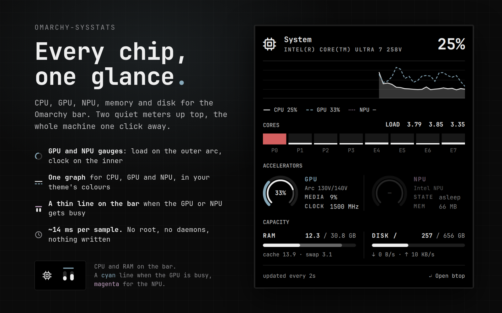

# omarchy-sysstats

**Every chip, one glance.** CPU, GPU, NPU, memory and disk for the
[Omarchy](https://omarchy.org/) shell bar: two quiet meters up top, and the
whole machine one click away.



Omarchy 4 ships no first-party system-stats widget. `omarchy.monitor` is
brightness and display controls, despite the name, so this fills the gap the
old Waybar `cpu` and `memory` modules used to, and goes past them: modern
laptops have a GPU and an NPU doing real work, and now you can see it.

- **GPU and NPU gauges.** Load on the outer arc, clock against the chip's
  maximum on the inner one. 30% busy at the floor clock is idling; 30% at full
  clock is not, and the gauge shows the difference.
- **One graph for every chip.** CPU as a filled area, GPU dashed and NPU
  dotted on top, in your theme's colours.
- **A bar icon that tells you when it matters.** CPU and memory meters, plus a
  thin line above them when the GPU or NPU gets busy.
- **Cheap.** About 14 ms of CPU every two seconds, no root, no daemons, and
  nothing written to disk.

## On the bar

Two level meters, CPU on the left and memory on the right, and no text.
Numbers on a 26px bar compete with the clock and rarely match the size of
anything around them, so the figures live in the panel. Hover for a one-line
summary.

A 2px line appears over the meters while a chip is busy: cyan for the GPU,
magenta for the NPU, split one segment per meter when both are. Busy means
above a limit you set ([`gpuAlertAt`, `npuAlertAt`](#settings)). The NPU's
defaults to any activity at all, since nothing on a desktop uses it by
accident. The line sits in the bar's spare height, so the meters never move
when it comes and goes.

The meters fill along a gamma curve rather than a straight line. Idle machines
sit in the bottom fifth of the scale, where a 13px track cannot separate 10%
from 25%; the curve spends more of the track on the range values actually
occupy and still tops out at 100%. It is a glanceable indicator, not a linear
readout. The panel carries exact numbers.

## In the panel

- **System**: CPU load and model, and a graph of the last 48 samples with the
  GPU and NPU traced over the CPU. A chip that has done nothing in that window
  draws no line.
- **Cores**: per-core activity with the CPU package temperature and the load
  average alongside. On hybrid Intel chips the cores are labelled `P0` and `E4`
  rather than by bare index. The grid wraps past eight and balances, so 12
  cores go 6+6 rather than 8+4. While the chip is slowing itself down for heat,
  the header adds *throttled N%*: the share of the last 30 seconds spent
  throttled, shown only from 1% so a lone burst does not flash it.
- **Accelerators**: a gauge per GPU and NPU, with the model, media-engine load
  and clock for the GPU, and clock and memory for the NPU. An NPU that has
  powered down dims and reads *asleep* rather than a misleading 0%. Machines
  without one simply leave the column out.
- **Capacity**: memory and the chosen mount side by side. The memory bar is
  split: solid for what apps hold, dim for cache the kernel will hand back on
  demand. Swap, and disk read and write rates, sit underneath.

Press Enter, or click *Open btop* in the footer, for per-process detail.

Click the bar widget to open the panel. It registers as a normal bar panel, so
`SUPER + CTRL + <n>` opens it by position and Tab moves between it and its
neighbours. Meters, graph, cores and bars tint together: base foreground below
`warnAt`, ramping to the theme's urgent colour by `criticalAt`, so a value
resting on a threshold does not strobe.

## GPU and NPU support

| Hardware | Driver | Shown |
|---|---|---|
| Intel Arc and Xe graphics, Lunar Lake and later | `xe` | Load, media load, clock. Tested on an Arc 140V |
| Older Intel integrated graphics | `i915` | Load and clock. Untested |
| AMD Radeon | `amdgpu` | Load only, no clock arc. Untested |
| NVIDIA | — | Not shown. Reading it means running `nvidia-smi` every sample |
| Intel NPU, Meteor Lake and later | `intel_vpu` | Load, clock, memory. Tested on Lunar Lake |

**GPU load** is the share of time the graphics engine was awake rather than in
its sleep state. It tracks real load closely without the elevated permissions
the GPU's performance counters need, or the cost of walking every process's
GPU accounting.

**The bar's GPU limit uses work**, not load: load scaled by clock against the
chip's maximum. Desktop compositing keeps a GPU awake much of the time with
many tiny jobs at its floor clock; video, games and compute make its firmware
raise the clock. Work tells the two apart where load alone cannot. On a
120Hz HiDPI laptop panel, compositing alone can reach about half the GPU's
work, so raise `gpuAlertAt` there if the line shows too often.

A GPU that has been powered down is never read. On a discrete GPU, reading it
would wake it and cost more battery than the widget is worth.

## Install

```bash
omarchy plugin add https://github.com/RohitKaushal7/omarchy-sysstats.git --enable
```

Then place it wherever you like on the bar:

```bash
omarchy bar move dev.reuk.sysstats --section right --before omarchy.power
```

Plugins run as unsandboxed code inside `omarchy-shell`. Read `Panel.qml` before
enabling it. It is a single file with no build step.

## Remove

```bash
omarchy plugin remove dev.reuk.sysstats
```

That deletes `~/.config/omarchy/plugins/dev.reuk.sysstats/` and drops the widget
from the bar. Nothing else is left behind: the plugin writes no files, no state
and no configuration of its own, and it installs no packages or services. If you
added a layout entry by hand, remove it from `bar.layout` in
`~/.config/omarchy/shell.json`.

## Settings

Change them from the bar's widget settings, or with `omarchy bar set`:

```bash
omarchy bar set dev.reuk.sysstats gpuAlertAt 65 --json
omarchy bar set dev.reuk.sysstats mount /home
```

They live on the widget's entry in `~/.config/omarchy/shell.json`:

```json
{ "id": "dev.reuk.sysstats", "interval": 2, "mount": "/", "warnAt": 60, "criticalAt": 85, "gpuAlertAt": 50, "npuAlertAt": 0 }
```

| Key | Default | What it does |
|-----|---------|--------------|
| `interval` | `2` | Seconds between samples |
| `mount` | `"/"` | Mount point reported in the capacity row |
| `warnAt` | `60` | Percent at which meters start tinting |
| `criticalAt` | `85` | Percent at which meters reach the urgent colour |
| `gpuAlertAt` | `50` | Show the bar's GPU line while GPU work is above this percent |
| `npuAlertAt` | `0` | Show the bar's NPU line while NPU load is above this percent. `0` marks any activity |

## What it reads, and what it does not

No privileges, no network, no services, no installers. Nothing is written
anywhere.

Every sample runs one short-lived `sh` that reads `/proc/stat`,
`/proc/meminfo`, `/proc/loadavg`, `/proc/cpuinfo`, `/proc/diskstats` and `df`
for the chosen mount. GPU and NPU figures come from the same shell, read from
sysfs with the `read` builtin so they start no extra processes:

- `xe`: `tile*/gt*/gtidle/idle_residency_ms` and `freq0/cur_freq`, `rp0_freq`
- `i915`: `gt/gt0/rc6_residency_ms`, `gt_cur_freq_mhz`, `gt_RP0_freq_mhz`
- `amdgpu`: `gpu_busy_percent`
- `intel_vpu`: `npu_busy_time_us`, `npu_current_frequency_mhz`,
  `npu_max_frequency_mhz`, `npu_memory_utilization`
- temperature: `temp1_input` of the `coretemp`, `k10temp` or `zenpower` hwmon
  device. ACPI, embedded-controller and NVMe sensors are left alone: each read
  costs milliseconds, and an NVMe read can wake the drive.
- throttling: `cpu0/thermal_throttle/package_throttle_total_time_ms`, Intel only

Each sample uses only `coreutils`, `awk` and `grep`, all part of a base Arch
install. `lspci`, from `pciutils`, runs once at startup to name the devices.
`btop` is needed only if you open it.

A whole sample costs about 14 ms of CPU, the GPU and NPU reads about 1 ms of
that. `/proc` is read through a subprocess rather than a `FileView` because
procfs reports `st_size` 0, which size-based readers mishandle. Deltas are
computed in QML, so no sampling sleep is needed, and rates divide by the change
in `/proc/uptime` rather than the timer interval, so a late tick reports the
time that actually passed. Disk throughput sums whole block devices only, so
partitions are not counted twice.

Memory and storage are reported in GiB, labelled GB, the same convention
`free -h` and `btop` use. A 32 GB machine reads about 30.8.

## License

MIT, see [LICENSE](LICENSE).
